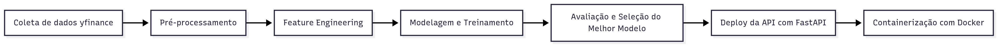

# 📈 Stock Prediction MLOps – PETR4


Este projeto é um pipeline completo de Machine Learning para *previsão do preço de fechamento das ações PETR4 (Petrobras)* no próximo dia, com *deploy via API REST usando FastAPI*.  
Foi desenvolvido como estudo de *MLOps*, abrangendo desde coleta e pré-processamento dos dados até modelagem, avaliação e disponibilização do modelo em produção.

---

## 🚀 Objetivo
Criar um modelo preditivo capaz de estimar o preço de fechamento da PETR4 no dia seguinte, disponibilizando-o em uma API onde o usuário informa o ticker e recebe a previsão.

---

## 📂 Estrutura do projeto
```

stock-prediction-mlops/
├── notebooks/
│   ├── 01_data_collection.ipynb       # Coleta e exploração dos dados
│   ├── 02_feature_engineering.ipynb   # Criação de features e modelagem inicial
│   └── 03_model_adjustment.ipynb      # Ajuste e avaliação de modelos
├── src/
│   ├── main.py                        # API FastAPI para servir o modelo
├── models/
│   ├── melhor_modelo_linearregression_petr4.joblib
│   └── scaler_petr4.joblib
├── data/
│   └── dados_petr4.parquet
├── Dockerfile
├── README.md
└── requirements.txt

````

---

## 🧠 Pipeline do projeto

```mermaid
flowchart LR
    A[Coleta de dados] --> B[Pré-processamento]
    B --> C[Feature Engineering]
    C --> D[Modelagem e Treinamento]
    D --> E[Avaliação e Seleção do Melhor Modelo]
    E --> F[Deploy da API com FastAPI]
    F --> G[Containerização com Docker]
````



---

## 📊 Comparação dos modelos

| Modelo               | RMSE     | MAE      | R²       |
| -------------------- | -------- | -------- | -------- |
| *LinearRegression* | *0.31* | *0.24* | *0.97* |
| Ridge                | 0.63     | 0.46     | 0.87     |
| Lasso                | 1.37     | 1.29     | 0.39     |
| ElasticNet           | 4.15     | 4.09     | -4.56    |

---

## 🎯 Escolha do modelo

O *LinearRegression* foi escolhido como modelo final devido a:

* *Menor RMSE* e *MAE* no conjunto de teste
* *R² = 0.97*, indicando alta capacidade de explicação da variabilidade dos preços
* Simplicidade e interpretabilidade

O Ridge apresentou bom desempenho, mas inferior ao LinearRegression.
O Lasso e ElasticNet tiveram queda significativa de performance devido à regularização excessiva.

---

## 📏 Explicação das métricas

* *RMSE (Root Mean Squared Error)*: mede o erro médio, penalizando mais erros grandes. Quanto menor, melhor.
* *MAE (Mean Absolute Error)*: média dos erros absolutos, fácil de interpretar pois está na mesma unidade da variável-alvo.
* *R² (Coeficiente de Determinação)*: mede o quanto o modelo explica da variação dos dados. Varia de 0 a 1; quanto maior, melhor.

---

## ⚙️ Tecnologias utilizadas

* Python 3.11
* Pandas / NumPy
* scikit-learn
* yfinance
* FastAPI / Uvicorn
* Docker
* Joblib

---

## 📜 Código principal da API (`src/main.py`)

```python
@app.get("/predict-price")
def predict_price(ticker: str = Query(..., description="Ticker da empresa, ex: PETR4.SA")):
    features = get_features_from_ticker(ticker)
    prediction = model.predict(features)[0]
    return {
        "ticker": ticker,
        "predicted_price": round(float(prediction), 2),
        "prediction_date": datetime.now().strftime("%Y-%m-%d")
    }
```

---

## 🖥️ Teste a API Online

A API está disponível publicamente no Railway e pode ser testada diretamente:

🔗 *[Acessar API no Railway](https://stock-prediction-mlops-production.up.railway.app/)*

* *Documentação interativa (Swagger)*:
  [https://stock-prediction-mlops-production.up.railway.app/docs](https://stock-prediction-mlops-production.up.railway.app/docs)

* *Exemplo de requisição*:

  ```
  GET /predict-price?ticker=PETR4.SA
  ```

---

## 🐳 Executando com Docker

### 1️⃣ Build da imagem

```bash
docker build -t stock-prediction-api .
```

### 2️⃣ Rodando o container

```bash
docker run -p 8000:8000 stock-prediction-api
```

A API estará disponível em:

```
http://localhost:8000/docs
```

---

## 🤝 Como contribuir

1. Faça um fork do projeto
2. Crie uma branch: `git checkout -b minha-feature`
3. Commit suas alterações: `git commit -m 'Minha nova feature'`
4. Envie para o repositório: `git push origin minha-feature`
5. Abra um Pull Request

---

## 📅 Roadmap

* [ ] Implementar suporte a múltiplos tickers
* [ ] Criar re-treino automático do modelo
* [ ] Adicionar monitoramento de drift
* [ ] Hospedar em ambiente de produção com CI/CD

---

## 📄 Licença

Este projeto está licenciado sob a *Apache License 2.0*
